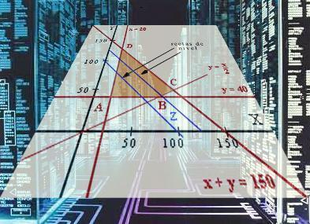

## Pagina de programacion lineal

En esta pagina voy a mostras las cosas amobrosas que estoy aprendiendo en el magnifico curso de programacion lineal

### Sympy
Aprendimos a utilizar la biblioteca sympy

## La chicharronera

$$x=\frac{-b+\sqrt{b^2-4ac}}{2a}$$

### Enlaces

- [Pagina de Python](https://www.python.org/)
- [Google](https://www.google.com/)
- [Github](https://github.com/Peperoni5000)

